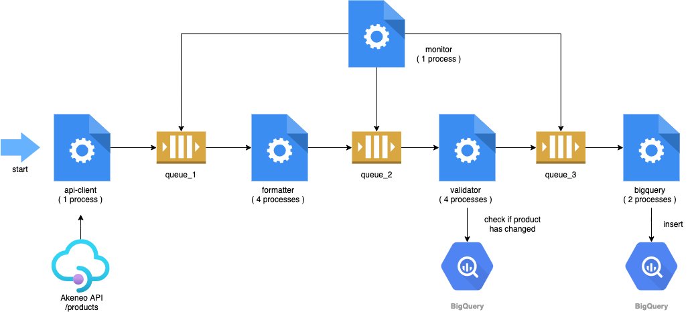

# Akeneo Pipeline



### BigQuery table

- `chb-prod-ingest-ecom.lightyear.akeneo`

Example: Get latest version of every product (Faces)

```sql
SELECT * EXCEPT(rank)
FROM (
   SELECT *, RANK() OVER(PARTITION BY id ORDER BY updated DESC) rank
   FROM `chb-prod-ingest-ecom.lightyear.akeneo`
   WHERE account="faces"
)
WHERE rank=1
```

Example: Get total updates by day (Faces)

```sql
SELECT account, DATE(metadata.ingestion_time) AS date, COUNT(*) as total
FROM `chb-prod-ingest-ecom.lightyear.akeneo`
WHERE account="faces"
GROUP BY account, date
ORDER BY date DESC
```

### Command line options for Akeneo

```sh
$ python main.py akeneo --help
usage: lightyear akeneo [-h] [-a {faces,tryano}]

optional arguments:
  -h, --help            show this help message and exit
  -a {faces,tryano}, --account {faces,tryano}
                        the akeneo account
```

### Docker Composer run

```sh
$ docker-compose run lightyear python main.py akeneo --account=tryano
Creating lightyear_lightyear_run ... done
[ INFO ] 2021-01-05 14:15:40 | main-0 (pid 1) | Starting 1 monitor process
[ INFO ] 2021-01-05 14:15:40 | monitor-1 (pid 8) | Process started
[ INFO ] 2021-01-05 14:15:40 | main-0 (pid 1) | Starting 1 api_client process
[ INFO ] 2021-01-05 14:15:40 | api_client-2 (pid 12) | Process started
[ INFO ] 2021-01-05 14:15:40 | main-0 (pid 1) | Starting 4 formatter processes
[ INFO ] 2021-01-05 14:15:40 | formatter-3 (pid 16) | Process started
[ INFO ] 2021-01-05 14:15:40 | formatter-4 (pid 17) | Process started
[ INFO ] 2021-01-05 14:15:40 | formatter-5 (pid 18) | Process started
[ INFO ] 2021-01-05 14:15:40 | main-0 (pid 1) | Starting 4 validator processes
[ INFO ] 2021-01-05 14:15:40 | formatter-6 (pid 19) | Process started
[ INFO ] 2021-01-05 14:15:40 | validator-7 (pid 23) | Process started
[ INFO ] 2021-01-05 14:15:40 | validator-8 (pid 24) | Process started
[ INFO ] 2021-01-05 14:15:40 | validator-9 (pid 25) | Process started
[ INFO ] 2021-01-05 14:15:40 | main-0 (pid 1) | Starting 2 bigquery processes
[ INFO ] 2021-01-05 14:15:40 | validator-10 (pid 26) | Process started
[ INFO ] 2021-01-05 14:15:40 | bigquery-11 (pid 30) | Process started
[ INFO ] 2021-01-05 14:15:40 | bigquery-12 (pid 31) | Process started
[ INFO ] 2021-01-05 14:15:43 | api_client-2 (pid 12) | 100 docs received from api
[ INFO ] 2021-01-05 14:15:44 | api_client-2 (pid 12) | 200 docs received from api
[ INFO ] 2021-01-05 14:15:44 | validator-9 (pid 25) | 100 docs processed
[ INFO ] 2021-01-05 14:15:44 | monitor-1 (pid 8) | Queue sizes: queue_1=47, queue_2=32, queue_3=5
...
[ INFO ] 2021-01-05 14:32:58 | monitor-1 (pid 8) | Queue sizes: queue_1=55, queue_2=2, queue_3=5
[ INFO ] 2021-01-05 14:32:58 | validator-10 (pid 26) | 18900 docs processed
[ INFO ] 2021-01-05 14:32:58 | formatter-5 (pid 18) | 19100 docs processed
[ INFO ] 2021-01-05 14:32:59 | bigquery-11 (pid 30) | 38500 docs sent to bigquery
[ INFO ] 2021-01-05 14:32:59 | bigquery-12 (pid 31) | 37900 docs sent to bigquery
[ INFO ] 2021-01-05 14:33:01 | api_client-2 (pid 12) | 76500 docs received from api
[ INFO ] 2021-01-05 14:33:01 | formatter-4 (pid 17) | 18900 docs processed
[ INFO ] 2021-01-05 14:33:01 | validator-8 (pid 24) | 19300 docs processed
[ INFO ] 2021-01-05 14:33:01 | monitor-1 (pid 8) | Queue sizes: queue_1=61, queue_2=10, queue_3=24
[ INFO ] 2021-01-05 14:33:02 | api_client-2 (pid 12) | 76526 docs received from api
[ INFO ] 2021-01-05 14:33:02 | api_client-2 (pid 12) | Process finished (76526 docs received)
[ INFO ] 2021-01-05 14:33:02 | main-0 (pid 1) | All api_client processes have finished
[ INFO ] 2021-01-05 14:33:02 | formatter-3 (pid 16) | Process finished (19398 docs processed)
[ INFO ] 2021-01-05 14:33:02 | formatter-5 (pid 18) | Process finished (19163 docs processed)
[ INFO ] 2021-01-05 14:33:02 | formatter-4 (pid 17) | Process finished (18930 docs processed)
[ INFO ] 2021-01-05 14:33:02 | formatter-6 (pid 19) | Process finished (19035 docs processed)
[ INFO ] 2021-01-05 14:33:02 | main-0 (pid 1) | All formatter processes have finished
[ INFO ] 2021-01-05 14:33:02 | validator-9 (pid 25) | Process finished (18889 docs processed)
[ INFO ] 2021-01-05 14:33:02 | validator-8 (pid 24) | Process finished (19331 docs processed)
[ INFO ] 2021-01-05 14:33:02 | validator-7 (pid 23) | Process finished (19364 docs processed)
[ INFO ] 2021-01-05 14:33:02 | validator-10 (pid 26) | Process finished (18942 docs processed)
[ INFO ] 2021-01-05 14:33:02 | main-0 (pid 1) | All validator processes have finished
[ INFO ] 2021-01-05 14:33:03 | bigquery-11 (pid 30) | Process finished (38535 docs processed)
[ INFO ] 2021-01-05 14:33:03 | bigquery-12 (pid 31) | Process finished (37991 docs processed)
[ INFO ] 2021-01-05 14:33:03 | main-0 (pid 1) | All bigquery processes have finished
```

### Parallel running processes

```sh
$ docker exec <container-id> /bin/bash -c 'ps fax'
  PID TTY      STAT   TIME COMMAND
    1 pts/0    Ss+    0:00 python main.py akeneo --account=tryano
    8 pts/0    S+     0:00 python main.py akeneo --account=tryano
   12 pts/0    Sl+    0:01 python main.py akeneo --account=tryano
   16 pts/0    Sl+    0:00 python main.py akeneo --account=tryano
   17 pts/0    Sl+    0:00 python main.py akeneo --account=tryano
   18 pts/0    Sl+    0:00 python main.py akeneo --account=tryano
   19 pts/0    Sl+    0:00 python main.py akeneo --account=tryano
   23 pts/0    Sl+    0:00 python main.py akeneo --account=tryano
   24 pts/0    Sl+    0:00 python main.py akeneo --account=tryano
   25 pts/0    Sl+    0:00 python main.py akeneo --account=tryano
   26 pts/0    Sl+    0:00 python main.py akeneo --account=tryano
   30 pts/0    S+     0:00 python main.py akeneo --account=tryano
   31 pts/0    S+     0:00 python main.py akeneo --account=tryano
```
