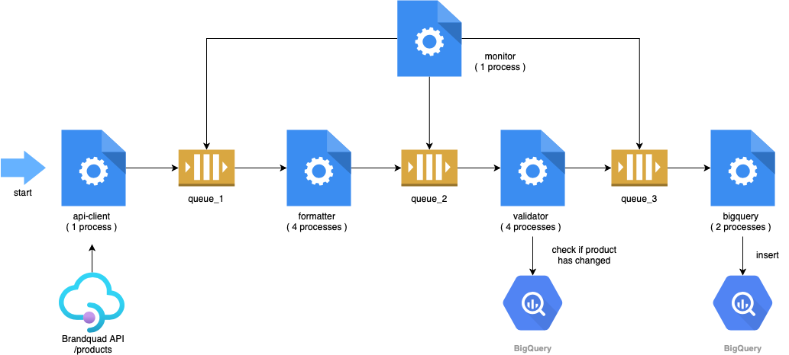

# Brandquad Pipeline



### BigQuery table

- `chb-prod-ingest-ecom.lightyear.brandquad`

### Command line options for brandquad

```sh
$ python main.py brandquad --help
usage: lightyear brandquad [-h]

optional arguments:
  -h, --help  show this help message and exit
```

### Docker Composer run

```sh
$ docker-compose run lightyear python main.py brandquad
$ docker-compose run lightyear python main.py brandquad
Creating lightyear_lightyear_run ... done
[ INFO ] 2021-01-07 12:54:16 | main-0 (pid 1) | Starting 1 monitor process
[ INFO ] 2021-01-07 12:54:16 | monitor-1 (pid 9) | Process started
[ INFO ] 2021-01-07 12:54:16 | main-0 (pid 1) | Starting 1 api_client process
[ INFO ] 2021-01-07 12:54:16 | api_client-2 (pid 13) | Process started
[ INFO ] 2021-01-07 12:54:16 | main-0 (pid 1) | Starting 4 formatter process
[ INFO ] 2021-01-07 12:54:16 | formatter-3 (pid 17) | Process started
[ INFO ] 2021-01-07 12:54:16 | formatter-4 (pid 18) | Process started
[ INFO ] 2021-01-07 12:54:16 | formatter-6 (pid 20) | Process started
[ INFO ] 2021-01-07 12:54:16 | main-0 (pid 1) | Starting 4 validator process
[ INFO ] 2021-01-07 12:54:16 | formatter-5 (pid 19) | Process started
[ INFO ] 2021-01-07 12:54:16 | validator-7 (pid 24) | Process started
[ INFO ] 2021-01-07 12:54:16 | validator-8 (pid 25) | Process started
[ INFO ] 2021-01-07 12:54:16 | validator-9 (pid 26) | Process started
[ INFO ] 2021-01-07 12:54:16 | main-0 (pid 1) | Starting 2 bigquery process
[ INFO ] 2021-01-07 12:54:16 | validator-10 (pid 27) | Process started
[ INFO ] 2021-01-07 12:54:16 | bigquery-11 (pid 31) | Process started
[ INFO ] 2021-01-07 12:54:16 | bigquery-12 (pid 32) | Process started
[ INFO ] 2021-01-07 12:54:19 | api_client-2 (pid 13) | 50 docs sent to queue_1
...

```

### Parallel running processes

```sh
$ docker exec <container-id> /bin/bash -c 'ps fax'
  PID TTY      STAT   TIME COMMAND
   45 ?        Rs     0:00 ps fax
    1 pts/0    Ss+    0:00 python main.py brandquad
    9 pts/0    S+     0:00 python main.py brandquad
   13 pts/0    Sl+    0:01 python main.py brandquad
   17 pts/0    Sl+    0:00 python main.py brandquad
   18 pts/0    Sl+    0:00 python main.py brandquad
   19 pts/0    Sl+    0:00 python main.py brandquad
   20 pts/0    Sl+    0:00 python main.py brandquad
   24 pts/0    Sl+    0:00 python main.py brandquad
   25 pts/0    Sl+    0:00 python main.py brandquad
   26 pts/0    Sl+    0:00 python main.py brandquad
   27 pts/0    Sl+    0:00 python main.py brandquad
   31 pts/0    S+     0:00 python main.py brandquad
   32 pts/0    S+     0:00 python main.py brandquad
```
