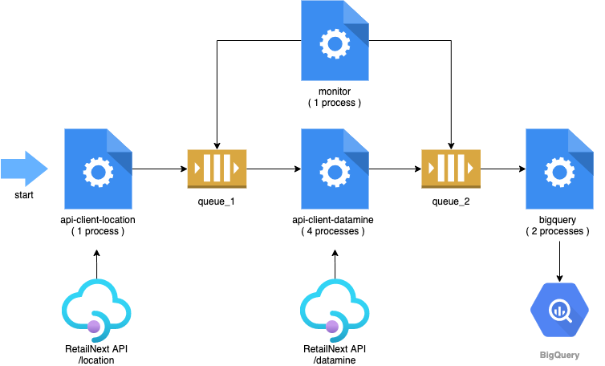

# RetailNext Pipeline



### BigQuery table

- `chb-prod-ingest-ecom.lightyear.retailnext`

### Command line options for RetailNext

```sh
$ python main.py retailnext --help
usage: lightyear retailnext [-h]

optional arguments:
  -h, --help            show this help message and exit
  -a {swarovski}, --account {swarovski}
                        the retailnext account
```

### Docker Composer run

```sh
$ docker-compose run lightyear python main.py retailnext --account=swarovski
Creating lightyear_lightyear_run ... done
[ INFO ] 2021-01-05 14:44:24 | main-0 (pid 1) | Starting 1 monitor process
[ INFO ] 2021-01-05 14:44:24 | monitor-1 (pid 10) | Process started
[ INFO ] 2021-01-05 14:44:24 | main-0 (pid 1) | Starting 1 api_client_location process
[ INFO ] 2021-01-05 14:44:24 | main-0 (pid 1) | Starting 4 api_client_datamine processes
[ INFO ] 2021-01-05 14:44:24 | api_client_datamine-3 (pid 18) | Process started
[ INFO ] 2021-01-05 14:44:24 | api_client_location-2 (pid 14) | Process started
[ INFO ] 2021-01-05 14:44:24 | api_client_datamine-4 (pid 19) | Process started
[ INFO ] 2021-01-05 14:44:24 | api_client_datamine-5 (pid 20) | Process started
[ INFO ] 2021-01-05 14:44:24 | main-0 (pid 1) | Starting 2 bigquery processes
[ INFO ] 2021-01-05 14:44:24 | api_client_datamine-6 (pid 21) | Process started
[ INFO ] 2021-01-05 14:44:24 | bigquery-7 (pid 25) | Process started
[ INFO ] 2021-01-05 14:44:24 | bigquery-8 (pid 26) | Process started
[ INFO ] 2021-01-05 14:44:24 | api_client_datamine-3 (pid 18) | Getting metrics for location Swarovski
[ INFO ] 2021-01-05 14:44:24 | api_client_datamine-4 (pid 19) | Getting metrics for location UAE
[ INFO ] 2021-01-05 14:44:24 | api_client_datamine-5 (pid 20) | Getting metrics for location KSA
[ INFO ] 2021-01-05 14:44:24 | api_client_datamine-6 (pid 21) | Getting metrics for location Qatar
[ INFO ] 2021-01-05 14:44:24 | monitor-1 (pid 10) | Queue sizes: queue_1=46, queue_2=0
...
[ INFO ] 2021-01-05 14:44:32 | api_client_datamine-6 (pid 21) | Getting metrics for location SWAROVSKI @ PODIUM - KSA
[ INFO ] 2021-01-05 14:44:33 | monitor-1 (pid 10) | Queue sizes: queue_1=6, queue_2=0
[ INFO ] 2021-01-05 14:44:33 | api_client_datamine-3 (pid 18) | Getting metrics for location Abha
[ INFO ] 2021-01-05 14:44:33 | api_client_datamine-4 (pid 19) | Getting metrics for location Entrance 1
[ INFO ] 2021-01-05 14:44:33 | api_client_datamine-5 (pid 20) | Process finished (39 docs processed)
[ INFO ] 2021-01-05 14:44:33 | monitor-1 (pid 10) | Queue sizes: queue_1=3, queue_2=0
[ INFO ] 2021-01-05 14:44:33 | api_client_datamine-6 (pid 21) | Process finished (40 docs processed)
[ INFO ] 2021-01-05 14:44:33 | monitor-1 (pid 10) | Queue sizes: queue_1=2, queue_2=0
[ INFO ] 2021-01-05 14:44:33 | api_client_datamine-3 (pid 18) | Process finished (40 docs processed)
[ INFO ] 2021-01-05 14:44:33 | api_client_datamine-4 (pid 19) | Process finished (40 docs processed)
[ INFO ] 2021-01-05 14:44:33 | main-0 (pid 1) | All api_client_datamine processes have finished
[ INFO ] 2021-01-05 14:44:37 | bigquery-8 (pid 26) | Process finished (77 docs processed)
[ INFO ] 2021-01-05 14:44:37 | bigquery-7 (pid 25) | Process finished (82 docs processed)
[ INFO ] 2021-01-05 14:44:37 | main-0 (pid 1) | All bigquery processes have finished
```

### Parallel running processes

```sh
$ docker exec <container-id> /bin/bash -c 'ps fax'
  PID TTY      STAT   TIME COMMAND
    1 ?        Ss     0:00 python main.py retailnext --account=swarovski
   10 ?        S      0:00 python main.py retailnext --account=swarovski
   14 ?        Sl     0:00 python main.py retailnext --account=swarovski
   18 ?        Sl     0:00 python main.py retailnext --account=swarovski
   19 ?        Sl     0:00 python main.py retailnext --account=swarovski
   20 ?        Sl     0:00 python main.py retailnext --account=swarovski
   21 ?        Sl     0:00 python main.py retailnext --account=swarovski
   25 ?        S      0:00 python main.py retailnext --account=swarovski
   26 ?        S      0:00 python main.py retailnext --account=swarovski
```
